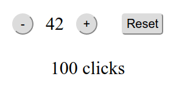

# Simple React-Redux Click Counter

[](https://github.com/peter-stuhlmann/SimpleReactReduxClickCounter/blob/master/LICENSE) 

[](https://github.com/peter-stuhlmann/SimpleReactReduxClickCounter/issues?q=is%3Aopen+is%3Aissue)
[](https://github.com/peter-stuhlmann/SimpleReactReduxClickCounter/issues?q=is%3Aissue+is%3Aclosed)

> Simple example for a click counter built with Redux in React.

<p align="center">
    
</p>

## Start

After cloning this repository install all npm's and start the App:

```
$ npm i  
$ npm start  
```

## Used

- create-react-app
- redux
- react-redux

## License

Licensed under the [MIT](https://github.com/peter-stuhlmann/SimpleReactReduxClickCounter/blob/master/LICENSE) License.   

---

[&copy; Peter R. Stuhlmann Webentwicklung](https://peter-stuhlmann-webentwicklung.de). All rights reserved.